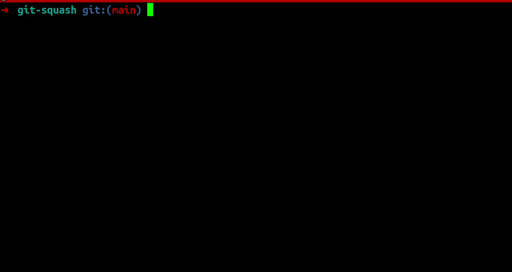

# git-squash

A simple CLI tool to squash multiple Git commits into a single commit.

## Demo



## Installation

[Download pre-compiled binary](https://github.com/andrejsstepanovs/git-squash/tags) or

### Install with go

```bash
go install github.com/andrejsstepanovs/git-squash@latest
````

## Usage

```bash
# Interactive mode
git-squash

# Specify commit hash and message directly
git-squash -a <commit-hash> -m "New squashed commit message"
```

**Options:**

* `-a, --hash` – Optional commit hash to squash from
* `-m, --message` – Optional commit message for the squashed commit
* `--max` – Auto-select the oldest selectable commit

## How it works

1. Lists squashable commits (not pushed yet).
2. Lets you select the starting commit interactively (or via `--hash`).
3. Performs a `git reset --soft` and commits the changes with your message.
